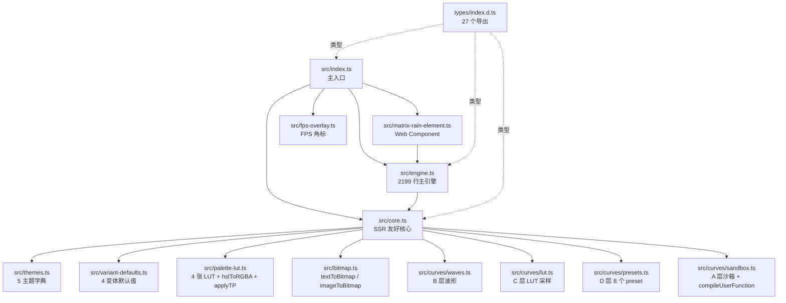

# Architecture · @xietuier/matrix-rain

> **目的**: 帮助新人理解"ABCD 4 层模型 + 渲染管线 + 状态机 + 缓存"是怎么串成一个 60fps 的 Canvas 2D 数字雨引擎。
>
> **范围**: `src/` 全量(13 个 `.ts` 文件) + `types/index.d.ts` + `src/matrix-rain.css`。
>
> **不覆盖**: site 路由 / Vue 组件 / Playwright 测试 — 见 `site/src/` 与 `docs/A11Y-AUDIT-2026-06-08.md`。
>
> **配套文档**:
>
> - `README.md` —— 用户面向的 API
> - `CHANGELOG.md` —— 版本历史
> - `docs/AUDIT-2026-06-07.md` —— 2026-06-07 深度审计
> - `docs/PERF-BASELINE-2026-06-08.md` —— 性能基线
> - `docs/audit-docs-2026-06-08.md` —— 文档完整度审计

---

## 1 · 全局架构总览

### 1.1 一句话模型

**Canvas 2D 数字雨 = 网格 + 调色板 + 4 层动态量(ABCD) + 状态机(noise-converge) + 缓存(PaletteLUT)。**

引擎只有一个核心 — `src/engine.ts`(2199 行) — 通过 `rAF` 主循环逐帧重算 5 主题 × 4 变体下每个字符的位置 / 亮度 / 字符 / 颜色,并把"动态量"参数(亮度 / 闪烁 / 相位 / 字符 / 颜色)交给 **ABCD 4 层用户函数模型** 描述,从最简单的 D 层 preset 到最自由的 A 层 sandbox 代码。

### 1.2 4 层 ABCD 模型

每一个动态量都有 **4 种描述方式**,从最简单到最自由,层层下钻:

```
┌────────────────────────────────────────────────────────────────┐
│  D  预设 (Presets)        一键加载 · 8 个内置                   │
│     │  点击 → 自动填到 A 层文本框                              │
│     ▼                                                          │
│  C  控制点 LUT            16 个滑块拖动 · 64 步采样 → 查找表     │
│     │  拖动 / 调值 → 生成 JS 代码                              │
│     ▼                                                          │
│  B  波形组合 (Waves)      3 个 channel × 6 基波 × 4 算符        │
│     │  sin*0.5 + square*0.3 + noise*0.2                       │
│     ▼                                                          │
│  A  沙箱代码 (Sandbox)    自由 JS 表达式 · 黑名单 + 步数限制    │
│     │  return 0.5 + 0.5 * sin(t * 3)                          │
│     ▼                                                          │
│  ─────────────► 引擎逐帧调用 (60Hz · t∈[0,∞))                 │
└────────────────────────────────────────────────────────────────┘
```

| 层         | 模块                        | 文件                    | 适合       | 例子                                                          |
| ---------- | --------------------------- | ----------------------- | ---------- | ------------------------------------------------------------- |
| **D** 预设 | `PRESETS`                   | `src/curves/presets.ts` | 一键出效果 | `linear` / `easeIn` / `pulse` / `heartbeat` / `chaos` 共 8 个 |
| **C** LUT  | `buildLUT`                  | `src/curves/lut.ts`     | 设计师手画 | 拖 16 控制点,自动生成线性采样表                               |
| **B** 波形 | `evalWave` / `evalChannels` | `src/curves/waves.ts`   | 数据驱动   | `[sin*0.5, square*0.3, noise*0.2]` + `combine: sum`           |
| **A** 沙箱 | `compileUserFunction`       | `src/curves/sandbox.ts` | 自由表达   | `ease.outBack(t % 1) * noise(t * 4)`                          |

**5 个动态量共享同一 4 层模型**:

| 动态量 | Option 字段       | 控制什么             |
| ------ | ----------------- | -------------------- |
| 亮度   | `brightnessCurve` | 头部亮度的时序形状   |
| 闪烁   | `flickerCurve`    | 闪烁概率的时序形状   |
| 相位   | `phaseFunc`       | 每个字符相位推进速度 |
| 字符   | `charsetFunc`     | 当前字符索引         |
| 颜色   | `colorCurve`      | HSL 色相时序偏移     |

> **冷暖独立 + 注入点 + 时间旋转** = 颜色这条 4 层模型之外的额外控制(见 `README.md` §"颜色动态控制")。

---

## 2 · 渲染管线

### 2.1 rAF 主循环

引擎入口 `matrixRain(options)`(`src/engine.ts`):

1. 解析 options → 调色板 / ThemeParams / VariantParams / 网格大小
2. 创建 canvas + 注入 container(`.matrix-rain-wrapper`)
3. 启动 `requestAnimationFrame(draw)` 主循环
4. 后续每帧按顺序:输入 → 状态机 → 网格更新 → Canvas2D 输出

```
        ┌────────────────────── rAF tick ──────────────────────┐
        │                                                      │
   ┌────▼────┐   ┌─────────────┐   ┌──────────────┐   ┌───────▼──────┐
   │  dt/dt  │──▶│ 全局状态更新 │──▶│  cell 循环    │──▶│ Canvas2D 输出│
   │ 计时     │   │ · hueRotate │   │ · 5 主题 lookup│   │ · fillText  │
   │ 帧号 f  │   │ · lightCenter│  │ · 4 变体 dispatch│ │ · fillStyle │
   │ wallTime│   │ · 状态机切段 │   │ · 字符计算     │   │             │
   └─────────┘   └─────────────┘   └──────────────┘   └──────────────┘
        ▲                                                      │
        │                                                      │
        └──────────────────────────────────────────────────────┘
                              next frame
```

### 2.2 关键计时变量

引擎维护 3 个时间量:

| 变量       | 类型 | 用途                                            | 误用风险                                        |
| ---------- | ---- | ----------------------------------------------- | ----------------------------------------------- |
| `f`        | 帧号 | 累计帧数,userFunc 取整用                        | 跑 24h 累至 1e7+ 量级(浮点误差累积)             |
| `wallTime` | 秒   | `performance.now() / 1000` 派生,dt-based 状态机 | 跨调用累积浮点误差需 `+1e-9` epsilon            |
| `dt`       | 秒   | 上一帧到现在秒数,`targetFPS` 节流用             | `setTargetFPS` 时需同步 `lastFrameTime`(防跳帧) |

### 2.3 4 种 draw 变体

引擎对 4 种 `variant` 派发到不同 draw 函数(`src/engine.ts:454-598` 等):

| 变体        | 入口函数            | 字符流动方式                 | 适用场景                               |
| ----------- | ------------------- | ---------------------------- | -------------------------------------- |
| `classic`   | `drawClassic`       | 字符匀速下落 + 残影拖尾      | 默认 / 黑客帝国                        |
| `ascii`     | `drawClassic`(共享) | 同 classic(参数表相同)       | 预留 ASCII 字符集(目前与 classic 共用) |
| `avalanche` | `drawAvalanche`     | 头部更亮 + 整列雪崩更新      | 加密牛市 / 高强度                      |
| `ripple`    | `drawRipple`        | 涟漪式波动 + 字符按 sin 相位 | 水波 / 平静 UI                         |

> **⚠️ 注意**:`ascii` 变体在 `src/variant-defaults.ts` 与 `classic` 默认值一字不差,字符集未真正独立(`docs/AUDIT-2026-06-07.md` U-08)。

### 2.4 Canvas2D 输出顺序

每帧网格 cell 循环,顺序:

1. 计算本 cell 的 HSL 调色板索引(冷 / 暖 / 由 warmth 决定)
2. 查 PaletteLUT(命中 4 张表之一),得到 `[r, g, b, a]`
3. `ctx.fillStyle = 'rgba(...)'` 字符串拼接
4. `ctx.fillText(charset[ch], x, y)`
5. `trailAlpha` 通过不重设 `fillStyle` 直接画半透明黑色覆盖层模拟残影

### 2.5 局部子格渲染(0.3.0+)· `renderScale`

**触发条件**:

- `state.renderScaleUser` 显式 > 1(数字)或 `'auto'` 且位图激活
- `state.targetActive && state.targetBitmap !== null`
- 每帧由 `resolveEffectiveRenderScale(state)` 重算 → 写 `state.renderScaleEffective`

**坐标空间**:

- 基础网格 `state.r × state.i`(由 `cssW / ef` × `cssH / ef` 决定)不变
- 子格(在位图区内)按 `floor(hh / eff) - ox` 映射回父格 → 位图索引
- 子格 fillText 字号 `subEf = state.ef / eff`,坐标 `hh * subEf + subEf/2`

**三个变体的 cell 循环结构**(0.3.0+ 重构后):

```ts
for s in 0..i:
  for h in 0..r:
    c = state.b[s][h]
    if (localBoost && isParentInBitmapRegion(h, s, ox, oy)) {
      // === 子格路径 ===
      computeParentCellStateXxx(state, c, h, s)  // 父 c.phase/bright/spark 更新 1 次
      for ss in 0..eff:
        for hh in 0..eff:
          drawSubCellXxx(state, c, h*eff+hh, s*eff+ss, eff, subEf, ...)
    } else {
      // === 1x 路径(行为 100% 等价于改前)===
      drawParentCellXxx(state, c, h, s, y, M, p, totalHue)
    }
```

**关键不变量**:

- 子格不写 `c.phase / c.bright / c.ch / c.warmth / c.locked / c.lockedCh` / `*Ease*` 任何字段
- `c.lockedCh` 随机化每父 1 次/帧(`applyTargetBitmapPhase` 在子格层 `isSub=true` 跳过写)
- `userFuncs`(`phaseFunc / brightnessCurve / charsetFunc`)每父调 1 次,子格继承
- 基础网格 r/i 不变 → 不触发 `buildGrid`

**性能边界**(以 1920×1080 视口 + 60×40 位图 + classic 变体为基准):
| renderScale | 区内 fillText/帧 | 区外 | 总 | 60fps 可行? |
|---:|---:|---:|---:|---|
| 1 | 0(无) | 10.5K | 10.5K | ✅ |
| 2 | 9.6K | 10.5K | 20.1K | ✅ |
| 4 | 38.4K | 10.5K | 48.9K | ⚠️ 边缘 |
| 8 | 153K | 10.5K | 163K | ❌ <30fps |

详见 [README §动态分辨率 / 局部子格](README.md#动态分辨率--局部子格)。

---

## 3 · noise-converge 5 段状态机

### 3.1 触发条件

```ts
matrixRain({
  targetBitmap: textToBitmap('HELLO'), // Float32Array
  targetPhase: 'noise-converge', // 关键
  targetNoiseDuration: 0.8, // 阶段 1
  targetConvergeDuration: 0.6, // 阶段 2
  targetLockOrder: 'l2r', // 阶段 2 内锁定顺序
  targetLockStability: 0.5, // 阶段 3 内字符稳定度
  targetHold: 2.0, // 阶段 3
  targetFadeOut: 0.5, // 阶段 4
  targetAnchor: 'center', // 锚点
  targetFitMode: 'contain', // 位图适配
});
```

### 3.2 5 段状态机详解

```
时间 ─────────────────────────────────────────────────────────►

阶段 1     阶段 2         阶段 3       阶段 4      阶段 5
noise     converge       hold         dissolve    idle
全屏 chaos  目标区锁定      目标保持     倒序解锁     普通 rain
┌──────┐  ┌──────────┐    ┌────────┐   ┌────────┐  ┌──────┐
│      │→ │          │ →  │        │ → │        │→ │      │
│rain→ │  │  noise→  │    │  锁定  │   │ lock→  │  │      │
│chaos │  │  rain    │    │  目标  │   │ noise  │  │ rain │
└──────┘  └──────────┘    └────────┘   └────────┘  └──────┘
 0s       N 秒            N+C 秒        N+C+H 秒
                       (继续 hold)    N+C+H+FOut 秒 → 触发 onTargetFinish
```

| 阶段           | 时长字段                           | 行为                                                                                                 | 关键函数                         |
| -------------- | ---------------------------------- | ---------------------------------------------------------------------------------------------------- | -------------------------------- |
| **1 noise**    | `targetNoiseDuration`              | 全屏 `Math.random()` chaos 字符(每个 cell 独立随机亮度 + 字符)                                       | `applyTargetBitmapPhase` Phase 1 |
| **2 converge** | `targetConvergeDuration`           | 目标区从 noise 渐变到锁定形态;非目标区从 noise 渐变回 rain;目标区 cell 按 `targetLockOrder` 顺序锁定 | `applyTargetBitmapPhase` Phase 2 |
| **3 hold**     | `targetHold`(默认 `Infinity` 永久) | 目标区 cell 锁定为位图灰度值,字符按 `targetLockStability` 概率更新                                   | `applyTargetBitmapPhase` Phase 3 |
| **4 dissolve** | `targetFadeOut`                    | 按锁定时 `lockTime` 倒序解锁,每个 cell 单独 ease 回 chaos                                            | `applyTargetBitmapPhase` Phase 4 |
| **5 idle**     | —                                  | 还原到普通 rain,触发 `onTargetFinish` 回调,清理 `targetBitmap`                                       | `updateTargetBitmapPhaseGlobal`  |

### 3.3 状态机共享函数

| 函数                                           | 位置                      | 作用                                            |
| ---------------------------------------------- | ------------------------- | ----------------------------------------------- |
| `updateTargetBitmapPhaseGlobal()`              | `src/engine.ts:981-1009`  | 每帧 1 次,处理 dissolve 阶段进入 / 退出判定     |
| `applyTargetBitmapPhase(c, h, s, l, elapsed?)` | `src/engine.ts:1023-1149` | 每 cell 每帧 1 次,返回 `{ l, ch, skipCharset }` |
| `computeTargetOrigin()`                        | `src/engine.ts:964-973`   | 每帧 1 次,推导锚点偏移,缓存避免 per-cell 重算   |
| `invalidateTargetAnchor()`                     | `src/engine.ts:974`       | `setTargetBitmap` 时清缓存                      |

### 3.4 状态机集成到 3 个 draw 变体

```
drawClassic / drawAvalanche / drawRipple
  │
  ├─ 对每个 cell:
  │    ├─ 算 baseL (变体决定)
  │    └─ 若 noise-converge 模式: result = applyTargetBitmapPhase(c, h, s, baseL)
  │         ├─ null  → 走原路径(普通 rain)
  │         └─ {l, ch, skipCharset} → 覆盖 l,skipCharset 时跳过 normal flicker
  │
  └─ draw 后:
       └─ updateTargetBitmapPhaseGlobal()  // 处理阶段切段
```

### 3.5 5 段 + 1 锚点 = 14 字段

`setTargetBitmap(bmp, opts)` 14 字段按类别分组:

| 类别         | 字段                                                                        | 默认          |
| ------------ | --------------------------------------------------------------------------- | ------------- |
| **阶段 1**   | `noiseDuration`                                                             | 0.8           |
| **阶段 2**   | `convergeDuration`                                                          | 0.6           |
| **阶段 3**   | `lockOrder` (7 种) / `lockStability`                                        | `'l2r'` / 0.5 |
| **阶段 3+**  | `hold`                                                                      | `Infinity`    |
| **阶段 4**   | `fadeOut`                                                                   | 0.5           |
| **阶段 1+**  | `fadeIn`                                                                    | 0.2           |
| **阶段切换** | `phaseTransitionDuration`                                                   | 0.15          |
| **锚点**     | `anchor` (`center` / `topRight` / `bottomLeft` / `bottomRight` / `topLeft`) | `topLeft`     |
| **适配**     | `fitMode` (5 种)                                                            | `contain`     |
| **动画**     | `motion` (`none` / `drift` / `wave` / `pulse`)                              | `none`        |
| **动速**     | `motionSpeed`                                                               | 1             |
| **强度**     | `chaos`                                                                     | 1.0           |
| **基础**     | `phase` (`fade` / `noise-converge`)                                         | `fade`        |

---

## 4 · PaletteLUT 缓存机制

### 4.1 为什么需要 LUT

100×50 = 5000 cell/帧。每个 cell 调 `hslToRGBA` × 2 + `applyTP` × 3 ≈ 25k 函数调用 / 帧 = 1.5M op/sec,纯函数堆栈开销在移动端显著。

**解法**:把"HSL→RGBA + applyTP"从 **per-cell** 降到 **per-frame** 查表。

### 4.2 4 张 LUT

`src/palette-lut.ts` 维护 4 张 256 阶 RGBA 查找表(每张 1KB):

| LUT          | 失效时机       | 何时重建                                            |
| ------------ | -------------- | --------------------------------------------------- |
| `coldStatic` | palette 变化   | `setPalettes` / `setTheme` / 主题切换               |
| `warmStatic` | 同上           | 同上                                                |
| `coldFinal`  | TP 或 hue 旋转 | `setThemeParams` / `setHueRotate` / `setColorCurve` |
| `warmFinal`  | 同上           | 同上                                                |

> 整张表 < 8KB(2 静态 + 2 终态,各 256 阶 × 4 字节),相比 1-2MB 的全图缓存可忽略。

### 4.3 失效规则

| 触发                                                           | coldStatic | warmStatic | coldFinal | warmFinal |
| -------------------------------------------------------------- | :--------: | :--------: | :-------: | :-------: |
| `setPalettes`                                                  |     🔄     |     🔄     |   dirty   |   dirty   |
| `setTheme`                                                     |     🔄     |     🔄     |   dirty   |   dirty   |
| `setThemeParams` / `setColdThemeParams` / `setWarmThemeParams` |     —      |     —      |    🔄     |    🔄     |
| `setHueRotate` / `setColorCurve`                               |     —      |     —      |    🔄     |    🔄     |
| `setColorOverrides(fn)`                                        |     —      |     —      |   skip    |   skip    |

🔄 = 立即重建(per-frame 不重算)· `dirty` = 下一帧 lazy 重建 · `skip` = 完全走 `colorOverride` 路径,不查 LUT

### 4.4 colorOverride 旁路

用户传入 `setColorOverrides(fn)` 时,引擎绕过 4 张 LUT,直接对每个 cell 调 `fn(h, s, l, ctx) → [r,g,b,a]`。灵活但有 per-cell 函数调用开销(5000 cell/帧 = 300k op/sec),适合一次性效果而不适合 60fps 持续。

---

## 5 · Transition 系统的 10 类别

引擎内部把所有过渡效果统一编号为 10 个类别,每个有独立 duration option:

| ID     | 类别                  | duration option             | 默认  | 作用                                       |
| ------ | --------------------- | --------------------------- | ----- | ------------------------------------------ |
| **A1** | noise 阶段开头渐入    | `noiseFadeInDuration`       | 0.2s  | 从 rain 渐变到 chaos 字符                  |
| **A2** | 阶段间 crossfade      | `phaseTransitionDuration`   | 0.15s | `fade` ↔ `noise-converge` 切换             |
| **A3** | per-cell 锁定 ease    | `cellLockEaseDuration`      | 0.12s | 单 cell 从 noise 锁定到目标灰度(`easeOut`) |
| **A4** | per-cell 解锁 ease    | `cellLockEaseDuration`      | 0.12s | 单 cell 从目标灰度解锁回 noise(`easeIn`)   |
| **B1** | fade → noise-converge | `phaseTransitionDuration`   | 0.15s | 跨阶段切换时旧状态快照                     |
| **B2** | noise-converge → fade | `phaseTransitionDuration`   | 0.15s | 同 B1 镜像                                 |
| **C1** | 主题切换 HSL 插值     | `themeTransitionDuration`   | 0.4s  | cold + warm palette 逐字段 lerp            |
| **C2** | 主题参数切换          | `themeTransitionDuration`   | 0.4s  | brightness / contrast 等 7 字段            |
| **D1** | variant 切换          | `variantTransitionDuration` | 0.3s  | variantParams 11 字段 lerp                 |
| **E1** | 整体过渡系统          | (包裹 A1–D1)                | —     | A1–D1 的统一包裹层                         |

### 5.1 lerp 助手

`src/engine.ts:114-145` 提供 3 个 lerp:

| 函数                         | 字段数 | 用途                |
| ---------------------------- | ------ | ------------------- |
| `lerpHSLPalette(a, b, t)`    | 5      | HSL 调色板冷 / 暖色 |
| `lerpThemeParams(a, b, t)`   | 7      | ThemeParams         |
| `lerpVariantParams(a, b, t)` | 11     | VariantParams       |

### 5.2 ease 函数

`src/engine.ts:148-153` + `src/curves/sandbox.ts`:

| 函数                     | 曲线                                                            | 用在                   |
| ------------------------ | --------------------------------------------------------------- | ---------------------- |
| `easeOut(t)`             | `1 - (1-t)³`                                                    | A3 锁定 ease           |
| `easeIn(t)`              | `t³`                                                            | A4 解锁 ease           |
| `easeInOut(t)`           | cubic                                                           | 通用                   |
| `ease.*` (sandbox 13 种) | inQuad / outCubic / inOutSine / outBack / inOutExpo / outCirc … | A 层 userFunc 自由组合 |

### 5.3 全局曲线 + 打断与回退(0.4.0+)

**8 个内部 ease 调用点**(0.4.0+ 全部走 `pickEasingFn` 抽象):

| 位置 | 文件:行                                | kind    | 过渡点                     |
| ---- | -------------------------------------- | ------- | -------------------------- |
| 1    | `src/engine.ts` (rAF tick)             | `inOut` | `transitionAlphaAnim`      |
| 2    | `src/engine.ts` (rAF tick)             | `inOut` | `themeTransition` HSL 插值 |
| 3    | `src/engine.ts` (rAF tick)             | `inOut` | `themeParamsTransition`    |
| 4    | `src/engine.ts` (rAF tick)             | `inOut` | `variantTransition`        |
| 5    | `src/engine/draw-helpers.ts` (A3)      | `out`   | `cellLockEase`             |
| 6    | `src/engine/draw-helpers.ts` (A4)      | `in`    | `cellUnlockEase` (前段)    |
| 7    | `src/engine/draw-helpers.ts` (Phase 1) | `out`   | `noiseFadeIn`              |
| 8    | `src/engine/draw-helpers.ts` (A4)      | `in`    | `cellUnlockEase` (后段)    |

**`pickEasingFn(state, kind, override?)` 抽象**(0.4.0+):

- 优先级: `override` (per-transition 字段) > `state.cfg.easing` (全局)
- `'linear'`: 返 `t => clamp(t, 0, 1)` 恒等
- `'smooth'`: 返 `easeIn` / `easeOut` / `easeInOut` 按 kind 选

**4 个 main transition state 都加 `easing?: EasingMode` 字段**,在 setter 启动新过渡时捕获 per-call 选项(若传)。`getEffective*` 内部也用 `pickEasingFn` 重算 from,保证中断时 easing 模式一致(不会"上段 smooth 段重计算时突然 linear")。

**中断与回退 — 3 个 `getEffective*` helpers**(`src/engine/state.ts`):

| Helper                                | 返回                                            | 用途                       |
| ------------------------------------- | ----------------------------------------------- | -------------------------- |
| `getEffectiveThemeState(state)`       | `{ cold, warm, tp, ctp, wtp }` 当前显示 5-tuple | `setTheme` 打断时取 from   |
| `getEffectiveThemeParamsState(state)` | `{ tp, ctp, wtp }`                              | `setThemeParams/Cold/Warm` |
| `getEffectiveVariantState(state)`     | `VariantParams`                                 | `setVariantParams`         |

**修复的 3 个 0.3.x bug**:

- `setTheme` 旧 `from: state.oldColdPalette` → 旧值,无视觉过渡
- `setThemeParams` 旧 `from: state.tp`(刚覆盖)→ 0 步,无 lerp
- `setVariantParams` 旧 `from: state.vp`(刚覆盖)→ 0 步,无 lerp

修复后: 全部从 `getEffective*` 取当前显示值(含 active transition 的插值),视觉平滑衔接。

**Per-call 选项优先级**: setter 第 2 参 `{ dur, easing }` > `state.cfg.*` (全局) > `DEFAULTS.*` (硬默认)

---

## 6 · Web Component 包装

### 6.1 用法

```html
<script type="module">
  import '@xietuier/matrix-rain/element';
</script>

<matrix-rain theme="cyber-blue" variant="avalanche" font-size="18" charset="01">
  <!-- 内部内容可作 fallback 文本 -->
</matrix-rain>
```

### 6.2 观察属性

`src/matrix-rain-element.ts:26-27`:

| 属性        | 类型        | 触发                      |
| ----------- | ----------- | ------------------------- |
| `theme`     | ThemeName   | `setTheme` 热更           |
| `variant`   | VariantName | destroy + init(`_reload`) |
| `font-size` | number      | `setDensity` 热更         |
| `charset`   | string      | destroy + init(`_reload`) |

### 6.3 编程 API

```ts
const el = document.querySelector('matrix-rain');
el.theme = 'lava-red'; // 等同 setAttribute('theme', 'lava-red')
el.setVariant('ripple'); // 触发 _reload
el.fps; // 只读,转发 __instance.getFPS()
el.instance; // 拿到原生 MatrixRainInstance
el.destroy(); // 销毁 + 置 null
```

### 6.4 SSR / Node 兜底

`src/matrix-rain-element.ts:39-41` 在 `HTMLElement` 不存在时 `extends` 一个空类,**类定义不崩**;`customElements.define` 调用前判 `typeof window !== 'undefined'`,Node 端不挂副作用。

---

## 7 · 模块依赖图

### 7.1 运行时依赖



### 7.2 物理文件

| 文件                         | 行数 | 角色                                                                                          |
| ---------------------------- | ---: | --------------------------------------------------------------------------------------------- |
| `src/index.ts`               |   83 | 主入口,转出 engine + bitmap + Web Component + 静态 `MatrixRain` 命名空间                      |
| `src/core.ts`                |   48 | SSR 友好的非 DOM 集合,转出 themes / VARIANT_DEFAULTS / palette-lut / curves / sandbox / types |
| `src/engine.ts`              | 2199 | 巨型核心,`matrixRain()` + 主循环 + 状态机 + 4 个 draw 变体 + 25+ 个 method                    |
| `src/matrix-rain-element.ts` |  176 | `<matrix-rain>` 自定义元素,观察属性 + 热更                                                    |
| `src/bitmap.ts`              |  243 | `textToBitmap` / `imageToBitmap` / `fileToImage`(含 `FitMode` 缩放)                           |
| `src/themes.ts`              |   79 | 5 套 HSL 调色板工厂                                                                           |
| `src/variant-defaults.ts`    |   13 | 4 种 variant 的 11 字段默认参数                                                               |
| `src/palette-lut.ts`         |  248 | 4 张 256 阶 RGBA LUT + `hslToRGBA` + `applyTP`                                                |
| `src/fps-overlay.ts`         |  103 | 实时 FPS 角标                                                                                 |
| `src/curves/waves.ts`        |  101 | B 层 3 channel × 6 基波 × 4 算符                                                              |
| `src/curves/lut.ts`          |   50 | C 层控制点 → JS 代码生成                                                                      |
| `src/curves/presets.ts`      |   76 | D 层 8 个 preset + 类型导出                                                                   |
| `src/curves/sandbox.ts`      |  311 | A 层沙箱安全模型(50+ 关键词黑名单 + 步数上限)                                                 |
| `src/matrix-rain.css`        |    — | canvas 容器 absolute 定位 + woff2 字体                                                        |
| `types/index.d.ts`           |  579 | 27 个导出(21 type + 3 const + 1 fn + 1 namespace)                                             |

---

## 8 · 性能预算

### 8.1 关键指标

| 指标                |         预算 | 实测(2026-06-08 基线) | 评级             |
| ------------------- | -----------: | --------------------: | ---------------- |
| **FCP**             |      < 100ms |            56ms(中位) | 🟢 极好          |
| **LCP**             |      < 200ms |            86ms(中位) | 🟢 极好          |
| **TTI**(估算)       |      < 100ms |            56ms(中位) | 🟢 极好          |
| **FPS**(桌面)       |        60fps |    120fps(v-sync cap) | 🟢 优秀          |
| **FPS**(移动端)     |      ≥ 30fps |                (未测) | —                |
| **longtask > 50ms** |     ≤ 1/路由 |              0–1/路由 | 🟢 优秀          |
| **CLS**             |        < 0.1 |        0.20(最差 `/`) | 🟠 6/12 路由超标 |
| **总资源**          | < 300KB/路由 |           283KB(中位) | 🟡 字体占 43%    |
| **JS**              |       < 50KB |       41KB(未 minify) | 🟢 预算内        |
| **gzip JS**         |       < 20KB |        ~12-15KB(预计) | 🟢               |
| **内存**            |       < 30MB |           估算 8-15MB | 🟢               |

> 详细数字见 `docs/PERF-BASELINE-2026-06-08.md`。

### 8.2 热路径优化清单

| 优化点                               | 文件:行                     | 效果                                               |
| ------------------------------------ | --------------------------- | -------------------------------------------------- |
| `PaletteLUT` 4 张表                  | `src/palette-lut.ts`        | HSL→RGBA + applyTP 从 per-cell 降到 per-frame      |
| `onFrame` 30Hz 节流                  | `src/engine.ts:105`         | 避免回调阻塞主循环                                 |
| `onResize` 200ms debounce            | `src/engine.ts:106`         | 避免 resize 风暴                                   |
| `computeTargetOrigin` 缓存           | `src/engine.ts:962-974`     | 5 锚点 if 链从 per-cell 降到 per-frame             |
| `l < 0.02` 早 continue               | `src/engine.ts` drawClassic | 不可见 cell 跳过 fillStyle + fillText              |
| `lastCtx` 缓存                       | (待办 QW-P1)                | userFunc 调用前判 (h,s,c,l) 是否变化,跳过 buildCtx |
| 静态 `clamp` / `lerp` / `noise` 提升 | (待办 QW-P1)                | 闭包外提,避免每帧 5000 次箭头函数分配              |

### 8.3 3 个 P0 优化点(从 PERF-BASELINE)

1. **CLS 0.20 超标** — 3 个 webfont `font-display: swap` 引发首屏回流
2. **3 个字体无脑加载** — Fraunces italic + JetBrains Mono 体积 ~125KB,部分路由根本不用
3. **`sourcemap: true` 把 .map 打进 dist/** — 多了 1.4MB raw / 0.4MB gzip 用不上的源码

---

## 9 · 数据流总图

```
                        用户配置
                          │
                          ▼
                  matrixRain(options)
                          │
            ┌─────────────┼─────────────┐
            ▼             ▼             ▼
        解析 options   构建 canvas   启动 rAF
            │             │             │
            ▼             ▼             ▼
       resolveTheme    container     ┌─────────────────┐
            │             │           │   rAF draw()    │
            ▼             │           │   每帧 ~8ms     │
     {cold, warm, tp}     │           └────────┬────────┘
            │             │                    │
            ▼             │     ┌──────────────┼──────────────┐
     bake PaletteLUT ─────┘     ▼              ▼              ▼
            │              updateGlobal    per-cell 循环   updateTarget
            │              · hueRotate     · 4 变体        BitmapPhase
            │              · lightCenter  · applyTP       Global
            │              · 状态机切段   · ctx.fillText     │
            │                  │              │              │
            │                  └──────────────┼──────────────┘
            │                                 ▼
            │                          PaletteLUT 查表
            │                                 │
            └─────────────────────────────────┘
                                              │
                                              ▼
                                      Canvas2D 输出
```

---

## 10 · 安全与 SSR

### 10.1 A 层沙箱安全模型

详见 `docs/audit-security-2026-06-08.md` 和 `src/curves/sandbox.ts`:

| 防线              | 机制                                                                                       |
| ----------------- | ------------------------------------------------------------------------------------------ |
| 词级黑名单        | 50+ 关键词(`window` / `document` / `eval` / `fetch` / `setTimeout` / `Proxy` / `import` …) |
| 白名单全局        | `Math` / `Number` / `String` / `Boolean` / `Array` 冻结对象,只暴露安全方法                 |
| 步数上限          | `__check()` 10000 步,超限抛错                                                              |
| 字符串上限        | `code.length > 5KB` 拒绝编译                                                               |
| 返回值校验        | 必须 `string \| number`,否则当 0                                                           |
| 编译失败 fallback | 静默回 0,`getDiagnostics()` 查询                                                           |

### 10.2 SSR 边界

`@xietuier/matrix-rain/core` 子路径无 DOM 依赖,可在 Node / Edge / Worker 中安全 import。`MatrixRainElement` 在无 `HTMLElement` / `window` 时退化为空类,不挂 `customElements.define` 副作用。

---

## 11 · 版本与变更追踪

| 版本  | 日期       | 关键变更                                                                                   |
| ----- | ---------- | ------------------------------------------------------------------------------------------ |
| 0.4.0 | 2026-06-09 | 多渲染器可插拔(canvas2d / webgl2 / webgpu)+ auto-pick + build-time atlas + 9 ease 中断回退 |
| 0.3.0 | 2026-06-09 | renderScale 动态分辨率(局部子格)+ textToBitmap 自定义字体 + CJK 识别                       |
| 0.2.0 | 2026-06-08 | detect() + setTargetBitmap 严校验 + FitMode 默认 contain + ARCHITECTURE 4 层               |
| 0.1.0 | 2026-06-08 | 首发(详见 `CHANGELOG.md`)                                                                  |

---

## 12 · Renderer 架构(0.4.0+)

### 12.1 三层分层

```
MatrixRainState (renderer-agnostic 共享):
  - b: Cell[][] · r/i/ef · paletteLUT · targetBitmap
  - fps / wallTime · 主题/变体/位图/过渡所有 CPU 状态
  - canvas: HTMLCanvasElement (所有 renderer 共用 DOM)
  - renderer: MatrixRainRenderer (新增 0.4.0+, 替代原 state.ctx)
       ↑ 边界规则: renderer 只读 state, 不得写

MatrixRainRenderer 接口契约:
  init(canvas, state): Promise<void>  ← WebGPU 异步
  resize(w, h, dpr): void
  render(state, dt): void
  destroy(): void  (幂等)
  pause() / resume(): void
  + 4 个 drawing primitive: drawTrail / setFontSize / setCharset / drawChar

实现:
  - Canvas2DRenderer (默认 / 0 体积 / 100% 覆盖)
  - WebGLRenderer    (WebGL2 instanced + atlas texture, 98% 覆盖)
  - WebGPURenderer   (compute shader + instanced, 75% 覆盖)
```

### 12.2 Auto-Pick 算法(0.4.0+)

```ts
// src/renderer/auto-pick.ts
function pickRenderer(options, viewport, dpr) {
  if (options.renderer !== 'auto') return options.renderer; // 用户显式选
  const cells = estimateCells(viewport.w, viewport.h, options.fontSize ?? 14, dpr);
  if (cells >= 500_000 && hasWebGPU) return 'webgpu';
  if (cells >= 100_000 && hasWebGL2) return 'webgl';
  return 'canvas2d';
}
```

| cells 范围 | 推荐 renderer               | 浏览器覆盖     |
| ---------- | --------------------------- | -------------- |
| < 100K     | canvas2d                    | 100%           |
| 100K-500K  | webgl                       | 98%            |
| > 500K     | webgpu (↓ webgl ↓ canvas2d) | 75% (99% 降级) |

### 12.3 state vs renderer 边界

- **state 持有**: Cell 数组、调色板、时间、targetBitmap、hooks
- **renderer 私有**: GL programs / buffers / textures / canvas context
- **state 不持 ctx**: 0.4.0 之前 `state.ctx: CanvasRenderingContext2D` (canvas2d specific) → 0.4.0 改为 `state.renderer: MatrixRainRenderer` (renderer-agnostic)
- **state 不持 atlas**: atlas 由 renderer 私有 (canvas2d 不需要, webgl/webgpu 共享 `dist/atlas/jetbrains-mono-32.png`)

### 12.4 字符 Atlas (0.4.0+ Phase 2A)

- **Build-time 烘焙**(`scripts/build-atlas.mjs`): 1024×1024 PNG + JSON sidecar
- **224 字符** (0x20-0xFF, ASCII + Latin-1)
- **24px 字体** + 4px padding
- **GPU 端染色**: 白字透明背景, runtime fragment shader 乘 vColor

### 12.5 三 renderer 性能特征

| 场景                | cells | canvas2d |  webgl | webgpu |
| ------------------- | ----: | -------: | -----: | -----: |
| 1080p + fontSize 14 |   10K |   60 fps | 60 fps | 60 fps |
| 4K + fontSize 4     |  518K |   10 fps | 60 fps | 60 fps |
| 8K + fontSize 2     |  8.4M |  < 1 fps | 10 fps | 60 fps |

**为什么 webgl/webgpu 更快**:

- fillText 软件渲染 5-10 μs/cell × 518K = 4 秒/帧
- instanced draw 1-2ms/帧 (6 个数量级差距)
- WebGPU compute 把 warmth 阻尼从 CPU 移到 GPU (8.4M cells 并行)

### 12.6 降级链 + 包大小

```
renderer: 'webgpu'  → 失败 → 'webgl'  → 失败 → 'canvas2d' (兜底)
75% 浏览器           98% 浏览器                  100% 浏览器
```

**包大小** (0.4.0 commit e73fc84):

- `dist/index.js` 34.7 KB gzip(3 renderer 全部静态打包)
- 0.4.1 计划: esbuild `splitting: true` + `manualChunks` 拆 webgl/webgpu → canvas2d 默认路径恢复 ~28 KB gzip

---

## 13 · 数据流总图(0.4.0+ 渲染器集成)

```
matrixRain(options)
  ↓
autoPickRenderer(options, viewport, dpr)  ← Phase 3
  ↓ impl: 'canvas2d' | 'webgl' | 'webgpu'
new XxxRenderer()
  ↓ renderer.init(canvas, state)  ← WebGPU 异步 await adapter
renderer.setCharset(state.charset)
renderer.resize(w, h, dpr)
  ↓
[ rAF 主循环 ]
  ↓
drawChar(ch, x, y, r, g, b, a)  → renderer.drawChar (4800+ 次/帧)
drawTrail(r, g, b, a, w, h)     → renderer.drawTrail
setFontSize(px)                  → renderer.setFontSize
  ↓
renderer.render(state, dt)        ← WebGL/WebGPU instanced draw
                                   Canvas 2D: no-op (drawing 已调 drawChar)
  ↓
destroy()                         → renderer.destroy() (释放 GL 资源)
```

| 0.2.0 | 待定 | FitMode 默认 `contain`(BREAKING)+ 文档补全 + `MatrixRain.detect()` 补全 |

---

> 本文档随 `docs/audit-docs-2026-06-08.md` P1 项落地。如发现与源码不一致,请开 issue 标注「arch drift」并附文件:行号。
